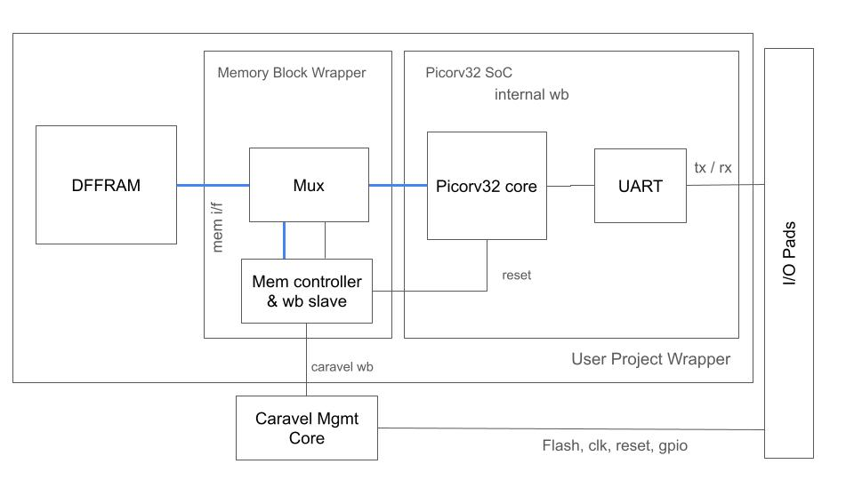
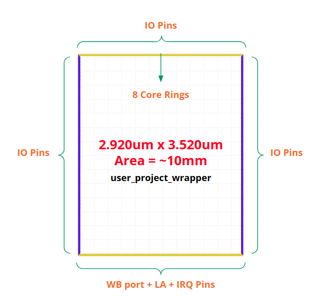
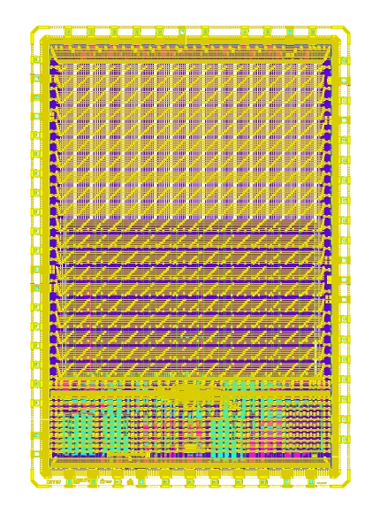
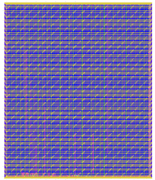
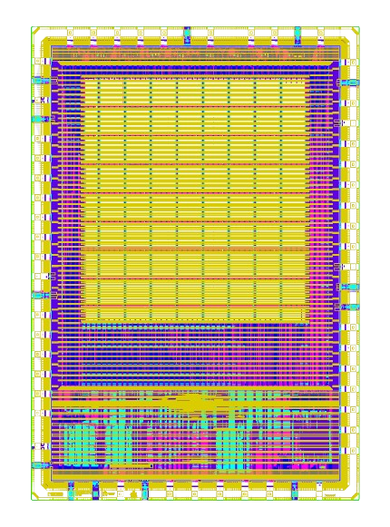

# Caravel User Project

[](https://opensource.org/licenses/Apache-2.0)  [](https://github.com/efabless/caravel_project_example/actions/workflows/user_project_ci.yml)  [](https://github.com/efabless/caravel_project_example/actions/workflows/caravel_build.yml) 

## Table of Contents

- [Overview](#overview)
- [Quickstart](#quickstart)
- [Caravel Integration](#caravel-integration)
  - [Repo Integration](#repo-integration)
  - [Verilog Integration](#verilog-integration)
  - [GPIO Configuration](#gpio-configuration)
  - [Layout Integration](#layout-integration)
- [Running Full Chip Simulation](#running-full-chip-simulation)
- [User Project Wrapper Requirements](#user-project-wrapper-requirements)
- [Hardening the User Project using OpenLane](#hardening-the-user-project-using-openlane)
- [Running Timing Analysis on Existing Projects](#running-timing-analysis-on-existing-projects)
- [Checklist for Open-MPW Submission](#checklist-for-open-mpw-submission)

## Overview

This repository contains a complete System-on-Chip (SoC) implementation using the PicoRV32 RISC-V processor core integrated within the Caravel user project wrapper. The design implements a fully functional microcontroller system with memory, UART communication, and GPIO interfaces, following the NCAT PicoRV32 SoC template architecture.

### Key Features

- **RISC-V RV32I Processor**: PicoRV32 core with Wishbone interface
- **Memory Subsystem**: 2KB DFFRAM512x32 memory with arbitration logic (DFFRAM512x32 placed at top level)
- **UART Interface**: CF_UART with FIFO support, 16-byte TX/RX FIFOs, and interrupt capabilities
- **Memory Programming**: External Wishbone slave interface for memory programming via Caravel management core
- **GPIO Interface**: UART connected to GPIO pins 20 (TX) and 21 (RX)
- **Standard RISC-V Memory Map**: Memory starts at 0x00000000

For complete design specifications, see the [Design Specification](design_specification.md) document.

## System Architecture

The system architecture follows the NCAT PicoRV32 SoC template, consisting of:



*Figure 1: System Architecture Diagram (NCAT Template)*

The architecture diagram above shows the complete system integration. Below is a text-based representation for reference:

```
┌─────────────────────────────────────────────────────────────┐
│                    Caravel User Project Wrapper            │
│  ┌─────────────────────────────────────────────────────────┐ │
│  │              PicoRV32 SoC Wrapper                       │ │
│  │  ┌─────────────┐  ┌─────────────────┐                    │ │
│  │  │ PicoRV32    │  │ CF_UART         │                    │ │
│  │  │ Core        │  │ Interface       │                    │ │
│  │  │ (Wishbone)  │  │ (Wishbone)      │                    │ │
│  │  └─────────────┘  └─────────────────┘                    │ │
│  │           │              │                               │ │
│  │           └──────────────┘                               │ │
│  │                          │                               │ │
│  │  ┌───────────────────────▼─────────────────────────────┐ │ │
│  │  │           Internal Wishbone Bus                     │ │ │
│  │  │           (Memory + Peripheral Access)              │ │ │
│  │  └─────────────────────────────────────────────────────┘ │ │
│  └─────────────────────────────────────────────────────────┘ │
│           │                    │                    │      │
│           └────────────────────┼────────────────────┘      │
│                                │                           │
│  ┌─────────────────────────────▼─────────────────────────┐  │
│  │              Memory Arbitration Logic                  │  │
│  │              (CPU Priority + External Access)           │  │
│  └─────────────────────────────────────────────────────┘  │
│           │                    │                    │      │
│           └────────────────────┼────────────────────┘      │
│                                │                           │
│  ┌─────────────────────────────▼─────────────────────────┐  │
│  │              DFFRAM512x32 Memory Block                │  │
│  │              (512 words × 32 bits = 2KB)               │  │
│  └─────────────────────────────────────────────────────┘  │
│                                │                           │
│  ┌─────────────────────────────▼─────────────────────────┐  │
│  │              External Wishbone Slave Interface         │  │
│  │              (for memory programming)                   │  │
│  └─────────────────────────────────────────────────────┘  │
└─────────────────────────────────────────────────────────────┘
```

### Memory Map

| Address Range | Peripheral | Description |
|---------------|------------|-------------|
| 0x00000000 - 0x000007FF | DFFRAM512x32 | 2KB instruction/data memory (512 words × 32 bits) |
| 0x00002000 - 0x00002FFF | CF_UART | UART registers and FIFO |
| 0x00003000 - 0x00003FFF | GPIO | General purpose I/O (placeholder) |

### GPIO Connections

- **GPIO 20**: UART TX output (`io_out[20]`)
- **GPIO 21**: UART RX input (`io_in[21]`)

## Prerequisites

- Docker: [Linux](https://docs.docker.com/desktop/install/linux-install/r) | [Windows](https://desktop.docker.com/win/main/amd64/Docker%20Desktop%20Installer.exe?utm_source=docker&utm_medium=webreferral&utm_campaign=dd-smartbutton&utm_location=header) | [Mac with Intel Chip](https://desktop.docker.com/mac/main/amd64/Docker.dmg?utm_source=docker&utm_medium=webreferral&utm_campaign=dd-smartbutton&utm_location=header) | [Mac with M1 Chip](https://desktop.docker.com/mac/main/arm64/Docker.dmg?utm_source=docker&utm_medium=webreferral&utm_campaign=dd-smartbutton&utm_location=header)
- Python 3.8+ with PIP

## Quickstart

### Starting Your Project

1. Create a new repository based on the [caravel_user_project](https://github.com/efabless/caravel_user_project/) template. Ensure your repo is public and includes a README.

   - Follow [this link](https://github.com/efabless/caravel_user_project/generate) to create your repository.
   - Clone the repository using:

     ```bash
     git clone <your github repo URL>
     ```

2. Set up your local environment:

   ```bash
   cd <project_name>
   make setup
   ```

   This command installs:

   - caravel_lite
   - Management core for simulation
   - OpenLane for design hardening
   - PDK
   - Timing scripts

3. Start hardening your design:

   This project uses a macro-first hardening strategy. Harden the macros in order:

     ```bash
     # Harden the memory arbitration logic (standard cell logic only)
     make memory_macro
     
     # Harden the PicoRV32 SoC
     make picorv32_soc
     ```

   Refer to [Hardening the User Project using OpenLane](#hardening-the-user-project-using-openlane) for detailed examples.

4. Integrate modules into the user_project_wrapper:

   The user_project_wrapper configuration includes references to both hardened macros plus DFFRAM512x32 (placed as a hard macro). Harden the wrapper:

     ```bash
     make user_project_wrapper
     ```

   This will integrate:
   - `memory_macro` (hardened macro with arbitration logic)
   - `picorv32_soc` (hardened macro)
   - `DFFRAM512x32` (hard macro, placed at top level due to met4 power straps)

5. Run cocotb simulation on your design:

   - Update `rtl/gl/gl+sdf` files in `verilog/includes/includes.<rtl/gl/gl+sdf>.caravel_user_project`.
   - Run `gen_gpio_defaults.py` script to generate `caravel_core.v`.
   - Run RTL tests:

     ```bash
     make cocotb-verify-all-rtl
     ```

   - For GL simulation:

     ```bash
     make cocotb-verify-all-gl
     ```

   - To add cocotb tests, refer to [Adding cocotb test](https://caravel-sim-infrastructure.readthedocs.io/en/latest/usage.html#adding-a-test).

6. Run opensta on your design:

   - Extract parasitics for `user_project_wrapper` and its macros:

     ```bash
     make extract-parasitics
     ```

   - Create a spef mapping file:

     ```bash
     make create-spef-mapping
     ```

   - Run opensta:

     ```bash
     make caravel-sta
     ```

 > [!NOTE]
 > To update timing scripts, run `make setup-timing-scripts`.

7. Run the precheck locally:

   ```bash
   make precheck
   make run-precheck
   ```

8. You're done! Submit your project at [Efabless Open Shuttle Program](https://efabless.com/open_shuttle_program/).

### GPIO Configuration

Specify the power-on default configuration for each GPIO in Caravel in `verilog/rtl/user_defines.v`. GPIO[5] to GPIO[37] require configuration, while GPIO[0] to GPIO[4] are preset and cannot be changed.

### Layout Integration

The Caravel layout includes an empty golden wrapper in the user space. Provide a valid `user_project_wrapper` GDS file. Your hardened `user_project_wrapper` will be integrated into the Caravel layout during tapeout.


Ensure your hardened `user_project_wrapper` meets the requirements in [User Project Wrapper Requirements](#user-project-wrapper-requirements).

### Running Full Chip Simulation

Refer to [ReadTheDocs](https://caravel-sim-infrastructure.readthedocs.io/en/latest/index.html) for adding cocotb tests.

1. Install the simulation environment:

   ```bash
   make setup-cocotb
   ```

2. Run RTL simulation:

   ```bash
   make cocotb-verify-<test_name>-rtl
   ```

3. After physical implementation, run full gate-level simulations to verify your design.

   ```bash
   make cocotb-verify-<test_name>-gl
   ```

## User Project Wrapper Requirements

Your hardened `user_project_wrapper` must match the [golden user_project_wrapper](https://github.com/efabless/caravel/blob/master/gds/user_project_wrapper_empty.gds.gz) in:

- Area (2.920um x 3.520um)
- Top module name "user_project_wrapper"
- Pin Placement
- Pin Sizes
- Core Rings Width and Offset
- PDN Vertical and Horizontal Straps Width



You can change the PDN Vertical and Horizontal Pitch & Offset.


We run an XOR check between your hardened `user_project_wrapper` GDS and the golden wrapper GDS as part of the [mpw-precheck](https://github.com/efabless/mpw_precheck) tool.

## Hardening the User Project using OpenLane

### OpenLane Installation

Install OpenLane with:

```bash
make openlane
```

For more detailed instructions, refer to the [ReadTheDocs](https://openlane.readthedocs.io/en/latest/getting_started/index.html).

### Hardening Options

There are three options for hardening the user project macro using OpenLane:

1. **Option 1**: Harden the user macro(s) first, then insert it into the user project wrapper with no standard cells at the top level.

   

   Example: [caravel_user_project](https://github.com/efabless/caravel_user_project)

2. **Option 2**: Flatten the user macro(s) with the user_project_wrapper.

   

3. **Option 3**: Place multiple macros in the wrapper along with standard cells at the top level.

   

   Example: [clear](https://github.com/efabless/clear)

For more details, refer to the [Knowledgebase article](https://info.efabless.com/knowledge-base/top-level-integration-and-power-management).

### Running OpenLane

For this project, we chose the first option: harden the user macros first, then insert them into the user project wrapper without standard cells at the top level.

The design consists of two macros that must be hardened in order, plus DFFRAM512x32 which is placed at the top level:

1. **memory_macro**: Contains memory arbitration logic (standard cell logic only, no DFFRAM512x32)
2. **picorv32_soc**: Contains PicoRV32 processor core, Wishbone interconnect, and peripherals
3. **DFFRAM512x32**: Hard macro placed at top level in user_project_wrapper (not hardened separately)

**Note**: DFFRAM512x32 is placed at the top level rather than inside memory_macro because it uses met4 power straps which conflict with hardening memory_macro as a macro. This architecture avoids PDN generation issues.

To reproduce this process, run:

```bash
# DO NOT cd into openlane

# Step 1: Harden the memory arbitration logic (standard cell logic only)
make memory_macro

# Step 2: Harden the PicoRV32 SoC
make picorv32_soc

# Step 3: Harden the user_project_wrapper (integrates both macros + DFFRAM512x32)
make user_project_wrapper
```

### Architecture Details

#### Memory Arbitration Logic (`memory_macro`)

The memory macro provides memory arbitration logic between CPU and external Wishbone slave:
- **Memory Arbitration**: Handles CPU priority access and external Wishbone slave access
- **DFFRAM512x32**: Not included in memory_macro; instantiated at top level due to met4 power strap conflicts
- **CPU Priority**: PicoRV32 CPU has priority access to memory
- **External Access**: Caravel management core can program memory when CPU is idle

See `openlane/memory_macro/config.json` for hardening configuration.

#### PicoRV32 SoC (`picorv32_soc`)

The SoC macro provides the processor and peripheral integration:
- **PicoRV32 Core**: RISC-V RV32I processor with Wishbone master interface
- **Wishbone Interconnect**: Routes memory and peripheral accesses
- **CF_UART**: Full-featured UART interface with FIFO support
- **GPIO Interface**: UART connections to GPIO pins 20/21

See `openlane/picorv32_soc/config.json` for hardening configuration.

For more information, refer to the [OpenLane Documentation](https://openlane.readthedocs.io/en/latest/index.html).

## Running Transistor Level LVS

To pass precheck, a custom LVS configuration file (`lvs_config.json`) is needed for your design. The configuration file should include:

Required variables:

- **TOP_SOURCE**: Top source cell name.
- **TOP_LAYOUT**: Top layout cell name.
- **LAYOUT_FILE**: Layout GDS data file.
- **LVS_SPICE_FILES**: List of spice files.
- **LVS_VERILOG_FILES**: List of Verilog files (child modules should be listed before parent modules).

Optional variables:

- **INCLUDE_CONFIGS**: List of configuration files to read recursively.
- **EXTRACT_FLATGLOB**: List of cell names to flatten before extraction.
- **EXTRACT_ABSTRACT**: List of cells to extract as abstract devices.
- **LVS_FLATTEN**: List of cells to flatten before comparing.
- **LVS_NOFLATTEN**: List of cells not to flatten in case of a mismatch.
- **LVS_IGNORE**: List of cells to ignore during LVS.

> [!NOTE]
> Missing files and undefined variables result in fatal errors.

## Running MPW Precheck Locally

Install the [mpw-precheck](https://github.com/efabless/mpw_precheck) by running:

```bash
make precheck
```

Run the precheck with:

```bash
make run-precheck
```

To disable LVS/Soft/ERC connection checks:

```bash
DISABLE_LVS=1 make run-precheck
```

## Running Timing Analysis on Existing Projects

Update the Makefile for your project:

```bash
make setup-timing-scripts
```

Run timing analysis:

```bash
make extract-parasitics

make create-spef-mapping

make caravel-sta
```

A summary of timing results is provided at the end.

## Checklist for Shuttle Submission

- ✔️ The project repo follows the directory structure in this repo.
- ✔️ Top level macro is named `user_project_wrapper`.
- ✔️ Full Chip Simulation passes for RTL and GL.
- ✔️ Hardened Macros are LVS and DRC clean.
- ✔️ Contains a gate-level netlist for `user_project_wrapper` at `verilog/gl/user_project_wrapper.v`.
- ✔️ Hardened `user_project_wrapper` matches the [pin order](https://github.com/efabless/caravel/blob/master/openlane/user_project_wrapper_empty/pin_order.cfg).
- ✔️ Matches the [fixed wrapper configuration](https://github.com/efabless/caravel/blob/master/openlane/user_project_wrapper_empty/fixed_wrapper_cfgs.tcl).
- ✔️ Design passes the [mpw-precheck](https://github.com/efabless/mpw_precheck).
